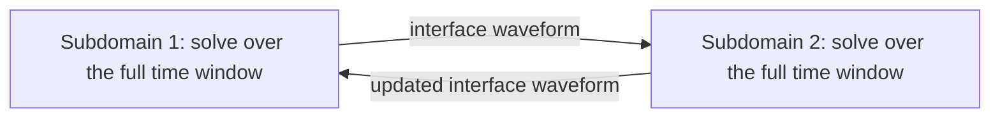

Hyperbolic problems transmit information along characteristics. Effective PinT methods either represent this propagation explicitly or avoid relying on a dissipative coarse temporal model.

## 3.1 Historical viewpoint

Multiple shooting, waveform relaxation, time-domain decomposition, and all-at-once solvers replace one long initial-value chain by local problems coupled through interface or continuity conditions. Their computational differences arise from how these coupling conditions are approximated and parallelized.

## 3.2 Schwarz waveform relaxation

SWR decomposes the spatial domain but exchanges an entire interface waveform over a time window:

Robin or characteristic transmission conditions can approximate incoming and outgoing waves more accurately than Dirichlet exchange for second-order hyperbolic equations. The overlap width, time-window length, and transmission parameter jointly determine convergence.

## 3.3 Parallel deferred correction

Integral deferred correction improves a provisional solution by solving an error equation based on the integral residual. In schematic form,

$$
e'(t)=f(t,u+e)-f(t,u)-r'(t),
$$

where $r$ is the residual of the current approximation.

- PIDC executes correction work across time windows but introduces synchronization between sweeps.
- RIDC pipelines the correction levels and reduces global synchronization.

The attainable concurrency is limited by the number of correction levels and by pipeline startup and drain time.

## 3.4 ParaExp

For

$$
u'(t)=Au(t)+g(t),
$$

ParaExp decomposes the interval into independent zero-initial-value inhomogeneous problems. The endpoint contributions are propagated by homogeneous matrix-exponential actions:

$$
u(t)=v_j(t)+\sum_{i\le j}e^{(t-T_i)A}b_i.
$$

Its efficiency depends on a fast and accurate implementation of $e^{tA}v$, commonly through a Krylov method. The construction is most direct for linear systems.

## 3.5 ParaDiag

The temporal matrix in an all-at-once discretization is close to Toeplitz. Replacing its strictly triangular coupling by an $\alpha$-circulant matrix yields

$$
C_\alpha=V_\alpha D_\alpha V_\alpha^{-1}.
$$

An FFT in time then decomposes one large space-time problem into independent complex-shifted spatial systems. ParaDiag-I applies this diagonalization directly. ParaDiag-II uses the circulant system as an iterative method or a preconditioner for the original non-circulant problem.

### Baseline ParaDiag-II experiment

The recomputed baseline uses $N_x=N_t=100$, $T=2$, $\nu=10^{-6}$, $\alpha=1$, and GMRES tolerance $10^{-12}$. It converges in 13 iterations and reaches a true relative residual of $1.149\times10^{-14}$.

![[assets/pint/paradiag-baseline.png]]

### Validation against Figure 3.15

The paper-grid validation fixes $N_x=N_t=100$ and $T=2$ while varying the viscosity:

| Viscosity $\nu$ | GMRES iterations | Interpretation                                                           |
| --------------: | ---------------: | ------------------------------------------------------------------------ |
|       $10^{-3}$ |                3 | the circulant preconditioner closely approximates the all-at-once system |
|       $10^{-6}$ |               13 | weaker diffusion reduces spectral clustering                             |

![[assets/pint/paradiag-figure-3-15.png]]

The result reproduces the iteration counts shown in Figure 3.15(c,d). It supports the stated parameter dependence for this discretization; it is not a viscosity-independent convergence claim.

### Parameters that affect ParaDiag

| Parameter               | Role                                    | Failure mode                                                                                        |
| ----------------------- | --------------------------------------- | --------------------------------------------------------------------------------------------------- |
| $\alpha$                | strength of the circulant approximation | very small values can make the transform ill-conditioned; large values can weaken the approximation |
| $N_t$                   | temporal transform size                 | larger values increase concurrency, transform cost, and memory                                      |
| shifted-solve tolerance | accuracy of each spatial solve          | loose solves pollute the outer iteration; unnecessarily tight solves add cost                       |
| $\nu$                   | physical dissipation                    | smaller values increase phase sensitivity and preconditioning difficulty                            |

## Computational coverage

The Python reproduction contains executable ParaDiag-II experiments and these are both reported above. The upstream MATLAB repository also contains SWR, PIDC/RIDC, ParaExp, direct ParaDiag, and wave-domain-decomposition scripts. Those scripts have been catalogued, but they do not yet have Python-equivalent formal result artifacts. This chapter therefore does not present newly computed curves for those methods.
