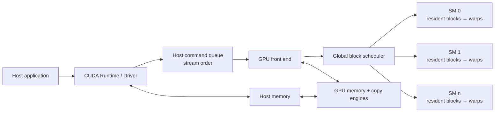
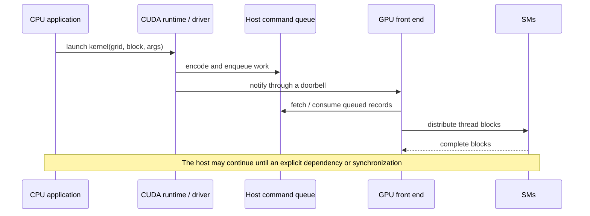
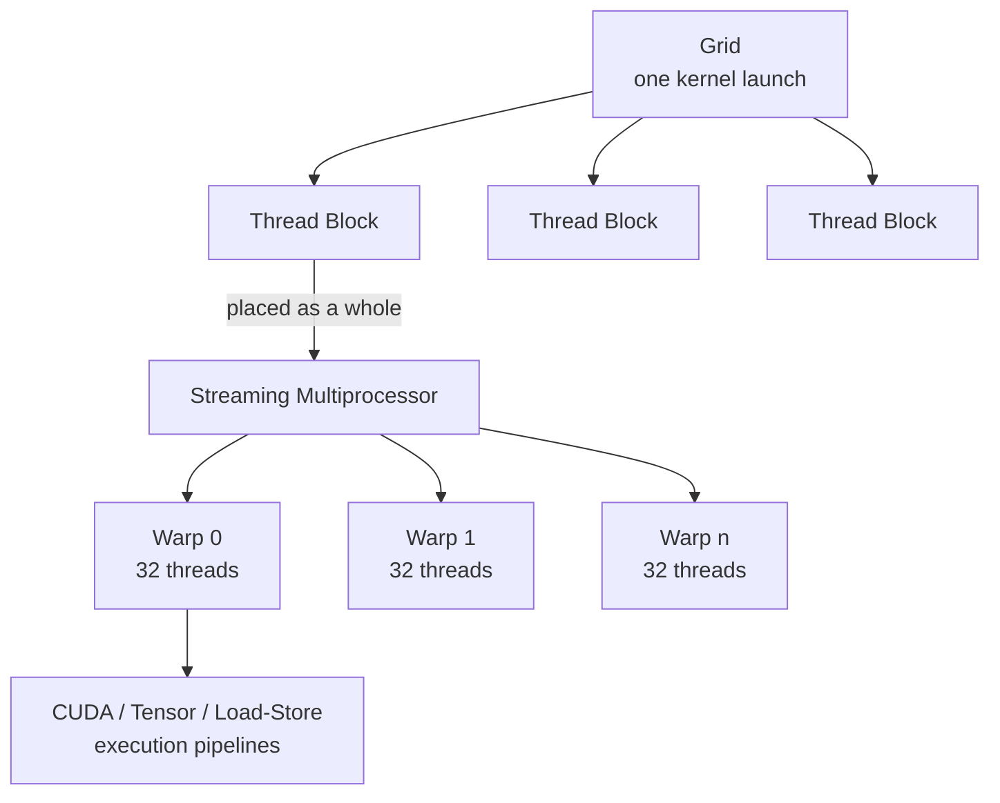
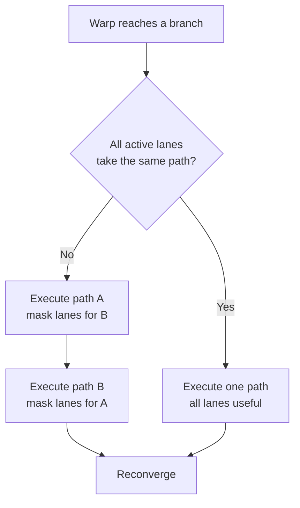

> [!note] Source and scope
> This page is an independently structured note based on the KM article “[AI Infra Introduction: How GPUs Work](https://km.woa.com/articles/show/631982?kmref=profile_feeds)” (updated October 25, 2025), not a reproduction of the original. The public version retains the technical thread, example parameters, and experimental results while omitting identities, organizations, comments, and internal information. Driver command formats, queue implementations, and scheduling details vary across GPU architectures, drivers, and CUDA versions; this note uses abstractions supported by public documentation where those details matter.

## The Core Mental Model

A GPU is not a large arithmetic unit controlled instruction by instruction by the CPU. The application uses the CUDA Runtime and driver to prepare memory, load device code, and submit work asynchronously. The GPU front end parses commands and assigns thread blocks to SMs that have sufficient resources. Each SM then schedules instructions at warp granularity.



The diagram separates three forms of parallelism:

1. **Host–device parallelism:** the CPU can continue after an asynchronous submission;
2. **Block-level parallelism:** different thread blocks can execute on different SMs;
3. **Warp-level parallelism:** an SM switches among ready warps to hide stalls.

## Why a GPU Does Not Necessarily Accelerate the Whole Program

The source article adds two `float` arrays, each of length $N=2^{30}$:

$$
y_i \leftarrow x_i+y_i.
$$

The GPU version runs on an NVIDIA T4 with `blockSize = 256` and targets `sm_75`:

```cpp
int blockSize = 256;
int numBlocks = (N + blockSize - 1) / blockSize;
add<<<numBlocks, blockSize>>>(N, d_x, d_y);
```

The reported single-run measurements are:

| Version                | Core compute time | Program `real` time | Error |
| ---------------------- | ----------------: | ------------------: | ----: |
| Single-thread CPU loop |           3740 ms |            21.418 s |     0 |
| T4 GPU kernel          |        48.6738 ms |            19.413 s |     0 |

Using the source's rounded comparison, the GPU kernel is about 75 times faster, while the complete program is only about two seconds shorter. Array allocation, host initialization, H2D/D2H transfers, CUDA context work, and synchronization are excluded from pure kernel time but included in end-to-end time.

> [!important] This is not a general CPU–GPU benchmark
> The CPU baseline is a serial loop, and the GPU result comes from one specific T4 run. The experiment supports a narrower conclusion: **local kernel speedup is not end-to-end speedup**. A rigorous comparison would also fix warm-up, memory policy, compiler optimization, a parallel CPU baseline, transfer scope, and the number of repetitions.

A useful decomposition is

$$
T_{\text{end-to-end}}
=
T_{\text{setup}}
+T_{\text{H2D}}
+T_{\text{kernel}}
+T_{\text{D2H}}
+T_{\text{sync}}
+T_{\text{host}}.
$$

A smaller $T_{\text{kernel}}$ is more likely to produce an end-to-end gain when the parallel workload is large, data reuse is high, or the data already resides on the GPU.

## From CUDA Compilation to Execution

### 1. Fat Binary

`nvcc` sends host code to the host compiler while processing device code such as `__global__` functions. An executable may contain:

- **SASS/cubin:** machine code for a specific GPU architecture, such as `sm_75`;
- **PTX:** a virtual instruction-set representation that the driver can JIT-compile for a target architecture;
- **host object:** ordinary C/C++ code executed by the CPU.

The driver can load a compatible cubin when one is present in the fat binary. Otherwise, it may JIT-compile PTX and typically cache the result. The precise compatibility choice depends on the toolchain and driver version.

### 2. The First CUDA Call

When a process first uses CUDA, the runtime and driver must establish a device context, address-space state, and other management structures. The first call is therefore often slower than later calls. Performance measurements should include an explicit warm-up so that one-time initialization is not counted as steady-state kernel latency.

### 3. Kernel Launch

A kernel launch submits the entry address, Grid/Block dimensions, dynamic shared-memory size, and parameter addresses. A command queue and doorbell provide a sufficiently accurate abstraction:



A doorbell is a device-visible register through which the CPU notifies the GPU that new work is available. Command packets, queue placement, and fetching behavior are driver and hardware details. Application logic should not depend on an internal description of one architecture.

Traditional `cudaMalloc` is a synchronous and relatively expensive allocation path. Since CUDA 11.2, the stream-ordered allocator has provided `cudaMallocAsync` and `cudaFreeAsync`. Production code should preferentially reuse memory pools instead of allocating and freeing on a hot path.

## Mapping the Programming Model to Hardware



| CUDA abstraction | Hardware meaning and constraint                                                                                       |
| ---------------- | --------------------------------------------------------------------------------------------------------------------- |
| Grid             | All thread blocks in one kernel launch                                                                                |
| Thread block     | Resource-allocation unit; normally remains on one SM until completion, with shared memory and block-wide barriers     |
| Warp             | Basic scheduling group on an NVIDIA GPU, normally containing 32 threads                                               |
| Thread           | Independent logical execution context with its own index and register state                                           |
| SM               | Hosts multiple blocks and warps and contains warp schedulers, a register file, shared memory, and execution pipelines |
| CUDA/Tensor Core | Arithmetic pipeline or specialized unit; it is not equivalent to one CUDA thread                                      |

A one-dimensional array commonly uses

$$
i=\texttt{blockIdx.x}\times\texttt{blockDim.x}+\texttt{threadIdx.x}
$$

to map software threads to elements. Memory transactions are more likely to coalesce when adjacent warp lanes access adjacent addresses. Two-dimensional grids and blocks make coordinates, tiling, and locality more natural for matrices and images.

## Memory Hierarchy and Data Reuse

GPU performance is not determined only by the number of arithmetic units. The program must also determine where data resides:

| Level               | Scope                                    | Typical use                                                    |
| ------------------- | ---------------------------------------- | -------------------------------------------------------------- |
| Registers           | Per thread                               | Scalars, addresses, and local intermediates                    |
| Shared memory / L1  | Per SM; shared memory is used by a block | Tiling, block collaboration, and reuse                         |
| L2                  | Whole GPU                                | Cross-SM caching and global-memory aggregation                 |
| HBM / device memory | Whole GPU                                | Model weights, activations, KV caches, and arrays              |
| Host memory         | CPU side                                 | Data exchange over PCIe, NVLink-C2C, or a similar interconnect |

The useful principle is not a fixed latency ordering. It is to reduce high-level byte movement: coalesce global-memory accesses, reuse tiles in shared memory or registers, and avoid unnecessary H2D/D2H round trips.

## How Occupancy Hides Latency

When a warp waits for memory or a data dependency, a warp scheduler can issue another ready warp. An SM therefore needs enough resident warps, but the number of resident blocks is jointly limited by registers, shared memory, threads, and architectural limits. Ignoring resource-allocation granularity, the following simplified upper bound provides intuition:

$$
B_{\mathrm{resident}}
\le
\min\left(
\left\lfloor\frac{R_{\mathrm{SM}}}{R_{\mathrm{thread}}T_{\mathrm{block}}}\right\rfloor,
\left\lfloor\frac{S_{\mathrm{SM}}}{S_{\mathrm{block}}}\right\rfloor,
\left\lfloor\frac{T_{\mathrm{SM}}}{T_{\mathrm{block}}}\right\rfloor,
B_{\mathrm{arch}}
\right).
$$

In the source's register example, one SM has 65536 registers and supports at most 2048 threads. With 64 registers per thread and 256 threads per block, registers can accommodate four blocks: 1024 threads or 32 warps, which gives 50% occupancy. At 128 registers per thread, the register limit falls to two blocks.

Shared memory can become the limiting resource as well. If an SM has 96 KB and each block uses 32 KB, at most three such blocks can be resident.

> [!warning] Occupancy is a constraint, not the objective
> At 100% occupancy, every warp can still be waiting for memory. Conversely, a compute-intensive kernel at lower occupancy may fully use the execution pipelines. Optimization should inspect occupancy together with instruction throughput, memory bandwidth, cache hit rates, and arithmetic intensity. Nsight Compute and roofline analysis can help identify the actual bottleneck.

## SIMD, SIMT, and Branch Divergence

| Model | Programmer-visible abstraction                        | Hardware execution emphasis                                                           |
| ----- | ----------------------------------------------------- | ------------------------------------------------------------------------------------- |
| SIMD  | One vector instruction operates on several data lanes | The program or compiler constructs vectors and masks                                  |
| SIMT  | A scalar program is written for one thread            | Hardware groups threads into warps and executes common instructions with active masks |

SIMT reduces the burden of explicit vectorization, but it does not remove SIMD-like execution constraints. When threads in one warp choose different `if/else` paths, the hardware generally executes the paths at different times and disables lanes that do not participate in the current path:



Volta and later architectures introduced Independent Thread Scheduling, which maintains finer-grained execution state and permits more flexible reconvergence and synchronization. It does not mean that 32 threads in one warp can execute 32 arbitrary instructions in the same cycle. Warp divergence can still reduce throughput.

Synchronization scope must be explicit:

- `__syncthreads()` is a block-wide barrier; all non-exited threads that should participate must reach it consistently;
- `__syncwarp(mask)` synchronizes only the warp lanes named by the mask, not necessarily all 32 threads;
- `__syncthreads()` cannot synchronize different blocks. Cross-block coordination requires a kernel boundary, cooperative groups, or another global mechanism.

## Performance-Diagnosis Checklist

1. **Separate the timings:** measure initialization, allocation, H2D/D2H, kernels, synchronization, and CPU post-processing independently.
2. **Warm up before measurement:** exclude one-time context creation, module loading, and JIT costs.
3. **Inspect access patterns:** determine whether adjacent lanes access adjacent addresses and whether tiles are reused in shared memory or registers.
4. **Inspect resource limits:** calculate the resident blocks allowed by registers/thread, shared memory/block, and threads/block.
5. **Inspect branch structure:** identify hot branches that keep lanes in one warp on different paths.
6. **Classify the bottleneck:** use a roofline model and a profiler to distinguish compute-bound, memory-bound, and launch-bound kernels.
7. **Tune block size last:** `256` is a common starting point, not a universal optimum. Select it from the kernel's resource use and measurements.

## What to Remember

1. The CPU organizes and submits work, while the GPU consumes queued commands asynchronously. Synchronization points determine when the host must wait.
2. CUDA Grid/Block/Thread objects are software abstractions, while SMs, warps, and execution pipelines form the hardware layer. Blocks and warps connect the two.
3. A GPU kernel can be much faster than a serial CPU loop, but initialization, transfers, allocation, and host work can still dominate end-to-end time.
4. Occupancy supplies alternative warps for latency hiding, but high occupancy alone does not guarantee high throughput.
5. SIMT hides explicit SIMD programming but cannot remove branch divergence. Correct synchronization scope and regular access patterns remain essential.

## Primary References

- [CUDA C++ Programming Guide](https://docs.nvidia.com/cuda/cuda-c-programming-guide/)
- [CUDA C++ Best Practices Guide](https://docs.nvidia.com/cuda/cuda-c-best-practices-guide/)
- [Volta Tuning Guide: Independent Thread Scheduling](https://docs.nvidia.com/cuda/volta-tuning-guide/)
- [An Even Easier Introduction to CUDA](https://developer.nvidia.com/blog/even-easier-introduction-cuda/)
