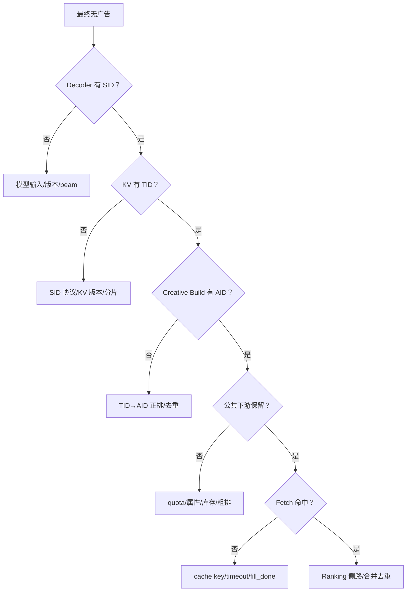

## 稳定性目标

| 目标   | 要求                                     |
| ------ | ---------------------------------------- |
| 可回滚 | 请求级瞬时切回旧路径，不依赖发版         |
| 可对照 | 新旧路径使用相同实验标签与公共下游口径   |
| 可定位 | 空结果/慢请求可定位到 Op、RPC 或漏斗阶段 |
| 可降级 | OneRec 失败不阻塞主链路                  |
| 可审计 | 最终生效参数与模型/KV 版本可追溯         |

## 两级开关

1. **请求级 Mixer 开关**：决定调用新 GprHub 生成式 RPC 或旧 Retrieval Proxy。
2. **GprHub set 级开关**：决定是否创建/启用新 `generative_flow_runner`。

回滚顺序：

- 线上指标异常：先把实验流量切回旧 RPC；
- 新 DAG 代码异常：关闭 set 级开关并重启对应 set；
- Fetch 超时：停止扩量，核对 pipeline P99 与 Ranking 预算；
- 模型/KV 版本错误：回滚模型包和 KV 版本，不能只调 beam。

## 灰度节奏

```text
部署（开关默认关）
  → 1%
  → 5%
  → 50%
  → 100%
  → 旧服务 QPS 归零
  → 清理 legacy 路径
```

每一步至少比较：

- 请求/成功/失败 QPS；
- GprHub 与 Fetch P95/P99；
- cache 写入和 Fetch 返回广告数；
- SID→TID→AID 漏斗；
- quota/过滤/粗排删量；
- 业务护栏。

## 三块看板

### 1. Mixer → GprHub

核心指标：

- recall request/success/fail；
- GprHub recall latency P99；
- cache ad count；
- request-to-cache latency；
- no-ad count。

它回答：新旧路径写 cache 是否健康。

### 2. 生成式流水线

每个 Op 上报：

- entry count；
- latency/P99；
- failed count；
- empty output；
- input/output ad count。

Datahub、Encoder、Decoder、KV 分别上报 RPC request/fail/latency。再加 SID→TID 漏斗：

```text
sid_key
  → kv_tid_pre_zorder
  → decoder_tids
  → creative_build_tid
  → unique_aid
```

它回答：新路径内部在哪一段丢量或变慢。

### 3. Ranking Fetch

核心指标：

- Fetch QPS、fail、timeout、key miss；
- Fetch latency 与 wait latency；
- response ad count / no-ad；
- cache 写完成到 Fetch 成功的端到端延迟。

它回答：Ranking 是否及时拿到侧路结果。

## 公共下游新旧对比

在 `AdListMerge` 之后，用 `recall_path` + `exp_tag` 对比：

| 阶段               | 重点                                       |
| ------------------ | ------------------------------------------ |
| OutputQuotaControl | 截断广告数、触发次数                       |
| PropertyFilter     | TID input/output 与删量率                  |
| CreativeServer     | 空 shard、请求/响应广告数、准备耗时        |
| Scoring            | 输入 TID/AID、top-n、响应大小              |
| Flow node          | 每个 Op latency、input/output、失败/空结果 |

归因顺序必须从上游到下游。若汇合前出口已不同，不应把最终广告差异归因给粗排；若汇合前一致但 PropertyFilter 后下降，才检查字段/库存对齐。

## 评审阈值

以下是当前评审建议，不应未经线上基线验证直接固化：

| 护栏                | 暂停扩量条件                           |
| ------------------- | -------------------------------------- |
| GprHub 写 cache P99 | $>150$ ms 持续 5 分钟                  |
| 分段 RPC 失败率     | $>1\%$ 持续 3 分钟                     |
| Fetch 超时          | 相对基线明显上升，评审草案采用 5% 变化 |
| 空结果              | 相对旧路径/同实验显著升高              |

阈值需要用流量、机型和 position 分桶。全局平均会掩盖长尾广告位。

## 故障树



## 清理 legacy 的门槛

旧路径只有在以下条件同时成立后才能下线：

1. 新路径全量且稳定跨过观察窗口；
2. 请求级回滚不再依赖旧服务，或已有等价灾备；
3. 旧服务 QPS 持续为零；
4. 新旧看板、报警和 on-call 手册完备；
5. Datahub 旧 workflow、Proxy `RemoteGprOp`、服务路由和图配置有明确删除清单；
6. 删除前完成一次反向切流演练。
