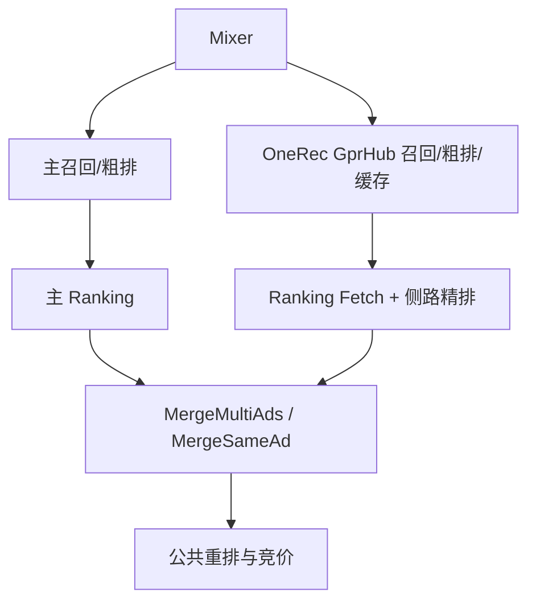

> [!warning] 临时内部评审稿
> 下述名称用于解释模块边界；环境、地址、实验 ID 和真实业务字段已脱敏。

## 1. 离线训练闭环

```text
行为/曝光日志
  → LogToFeature / USD 序列补全
  → OneRec SequenceExample
  → 样本筛选与奖励特征
  → RQ-VAE 语义 ID
  → HSTU/序列生成模型
  → checkpoint + 模型元信息
  → Encoder / Decoder 发布
```

RQ-VAE 与序列模型是两个版本耦合点：序列训练数据中的 token 编码必须对应同一套 codebook、层数和 SID 打包规则。模型发布不能只更新 checkpoint，还要同步：

- `model_version` 与 `data_name`；
- token/codebook 版本；
- trie 或 KV creative 版本；
- 每级 token 位宽与树深；
- Encoder/Decoder 支持的最大 beam。

## 2. 在线触发

Mixer 针对每个广告位读取实验参数，二选一触发：

- 新路径：`GenerativeRecall` 进入 GprHub 的 `GENERATIVE_FLOW`；
- 旧路径：`RetrievalProxy` 进入 Retrieval Proxy，再由 `RemoteGprOp` 访问旧 GPR 服务。

同一广告位请求只走一条路径，避免重复召回和双重扣量。多广告位请求必须在 service 层拆分，并为每个 position 复制正确的 `pos_id` 和 `exp_param`，不能复用第一个广告位的参数。

## 3. 新生成式召回 DAG

```mermaid
flowchart LR
  A["Entry"] --> B["Datahub"]
  B --> C["Encoder"]
  C --> D["Decoder"]
  D --> E["KV Creative"]
  E --> F["Creative List Build"]
  F --> G["Ad List Merge"]
  G --> H["Quota / Property Filter"]
  H --> I["Creative Server"]
  I --> J["Sharding + Coarse Scoring"]
  J --> K["Retrieval Cache"]
```



六个生成式节点的职责：

| 节点                | 输入                   | 输出                               | 失败时表现                   |
| ------------------- | ---------------------- | ---------------------------------- | ---------------------------- |
| Entry               | 单广告位请求、实验参数 | `GenerativeData`、quota、beam 参数 | 参数缺失或路径未命中         |
| Datahub             | 用户与上下文标识       | 生成式行为序列、模型输入上下文     | 空序列、RPC 超时             |
| Encoder             | 结构化序列             | 共享 user embedding、模型版本      | 输入 schema/模型版本错误     |
| Decoder             | embedding、树/模型参数 | SID 序列与分数                     | 空 SID、beam 越界            |
| KV Creative         | SID                    | TID 列表                           | 版本错、SID miss、分片空响应 |
| Creative List Build | TID 与分数             | 按 AID 去重的创意列表              | TID→AID 缺失、全被去重       |

之后与旧路径在 `AdListMerge` 附近汇合，进入同构的 quota、属性过滤、创意服务与粗排子图。

## 4. Ranking 与主链路合并

主链路继续执行常规召回、粗排和主 Ranking。OneRec 在 GprHub 中把结果写入 Retrieval Cache，Ranking 侧通过 `FetchGenerativeX` 等待 `fill_done` 后读取，执行独立的侧路精排。



这个拓扑的价值是隔离：

- OneRec 不占用主精排路径的候选 quota；
- 失败时可放弃侧路结果而不阻塞主链路；
- 最终合并点仍能做跨路径去重、统一约束和拍卖。

## 5. 缓存同步语义

Mixer 的召回 RPC 与 Ranking Fetch 是异步配合：

1. GprHub 为请求/广告位创建 cache node；
2. 生成式流水线结束后写广告列表、`recall_path`、实验标签并置 `fill_done`；
3. Ranking Fetch 命中 node 时，若尚未完成则等待到超时；
4. 成功后返回广告与上下文，失败区分 key miss、timeout、empty result。

必须分开监控“流水线本身慢”和“Fetch 等待慢”。前者看 GprHub 分段 RPC/Op；后者看 `fetch_wait_latency` 和 cache key 命中。

## 6. 关键不变量

- 同一 position 只选择新/旧一条召回路径；
- Encoder、Decoder、RQ-VAE codebook 与 KV creative 版本一致；
- SID 打包/解包层数和每层位宽一致；
- Decoder 输出分数随 SID 保持同序；
- Z-order/分片汇合后再按 quota 截断，避免单分片垄断；
- TID→AID 后按 AID 去重，不把同广告多创意误算成多广告；
- cache 写入量与 Ranking Fetch 返回量可交叉核对；
- OneRec 失败不应扩大为主链路失败。
