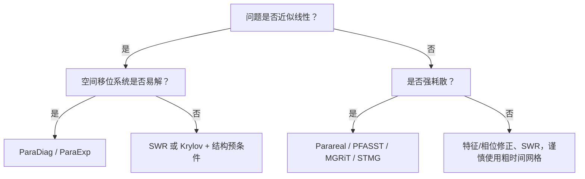

## 统一视角：都在近似全时间逆

不同 PinT 方法可以放在同一框架中：

$$
U^{k+1}=U^k+M^{-1}(b-AU^k),
$$

其中 $A$ 是 all-at-once 时空算子，$M^{-1}$ 是可并行近似逆。

| 方法     | $M^{-1}$ 的来源            |
| -------- | -------------------------- |
| Parareal | 粗传播器的块下三角逆       |
| MGRiT    | 时间多层 V-cycle           |
| STMG     | 完整时空多重网格           |
| ParaDiag | 循环化时间矩阵的 FFT 逆    |
| SWR      | 时空子域的局部逆与界面迭代 |

这比按缩写记忆更有用：比较方法时，问它近似了哪个逆、保留了哪些慢模、并行性来自哪里。

## 选择流程

### 强耗散、低到中阶时间精度

优先尝试 MGRiT 或 STMG；快速原型可从 Parareal 开始。粗传播器可以更大步长、更粗空间网格或更低阶，但必须保持稳定且保留慢模。

### 高阶时间精度

PFASST 更自然，因为 collocation 与 SDC 已嵌入算法。代价是复杂调度与更高内存。

### 线性大系统

若多个复移位空间系统可高效并行求解，ParaDiag 能提供高时间并行度；若矩阵指数作用高效，ParaExp 对波动问题很有吸引力。

### 强传播/近双曲

不要把“更耗散的粗解”误认为“更稳的粗解”。优先考虑特征条件、相位校正、SWR 或保结构粗层。

## 实验设计清单

一个可信的 PinT 结果至少应固定并报告：

1. 空间/时间离散及细解参考；
2. 时间片数、并行资源和粗细成本比；
3. 收敛准则相对离散误差的位置；
4. 每轮细传播、粗传播、通信与 setup 时间；
5. 参数扫掠，特别是黏性、波速、时间窗长度；
6. 误差随“等成本迭代”而非只随迭代数的曲线；
7. 并行效率与强/弱扩展性。

## 论文带来的核心结论

- 抛物问题仍是通用 PinT 方法最成熟的应用区。
- 双曲问题并非不能时间并行，而是必须把传播信息带入分解、粗层或预条件器。
- ParaDiag 展示了“全局时间耦合也可以并行”的另一条路线。
- 未来的高效实现更可能是空间并行、时间并行、异构加速和任务运行时的组合，而不是单一算法独立取胜。

下一步应围绕 [[计算数学/时间并行计算/数值实验室\|数值实验室]] 增加参数交互、真实并行计时和 GPU/多节点实现，而不只复现收敛曲线。
