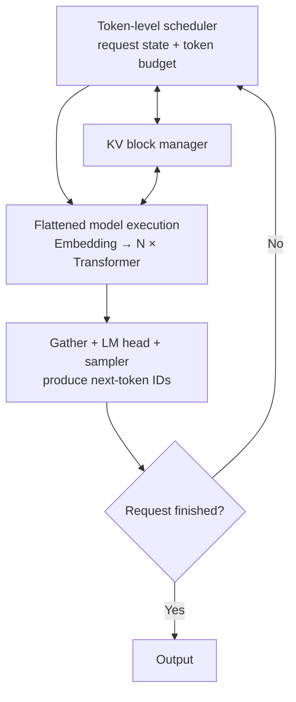
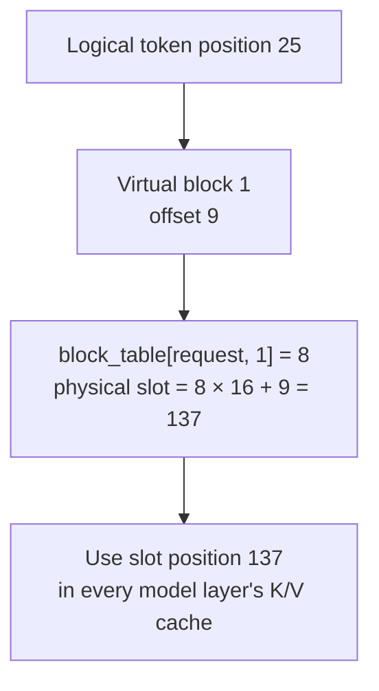
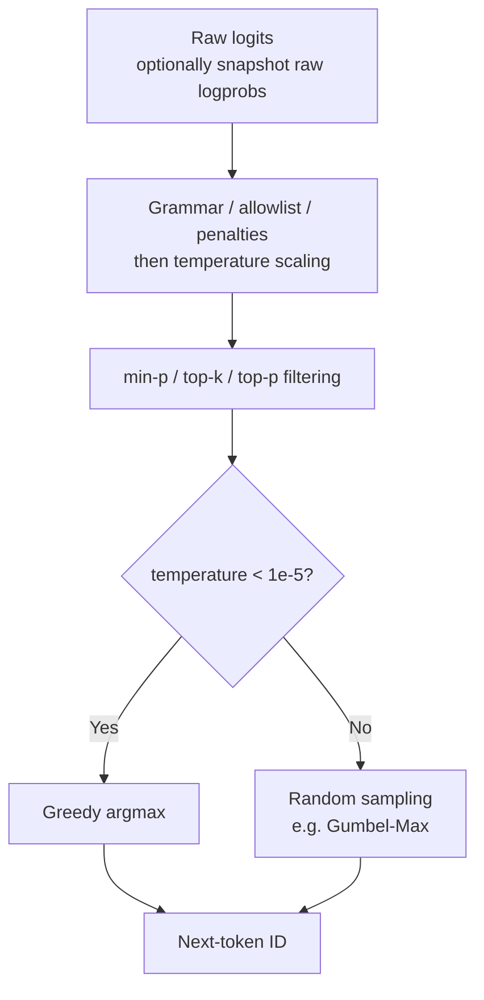
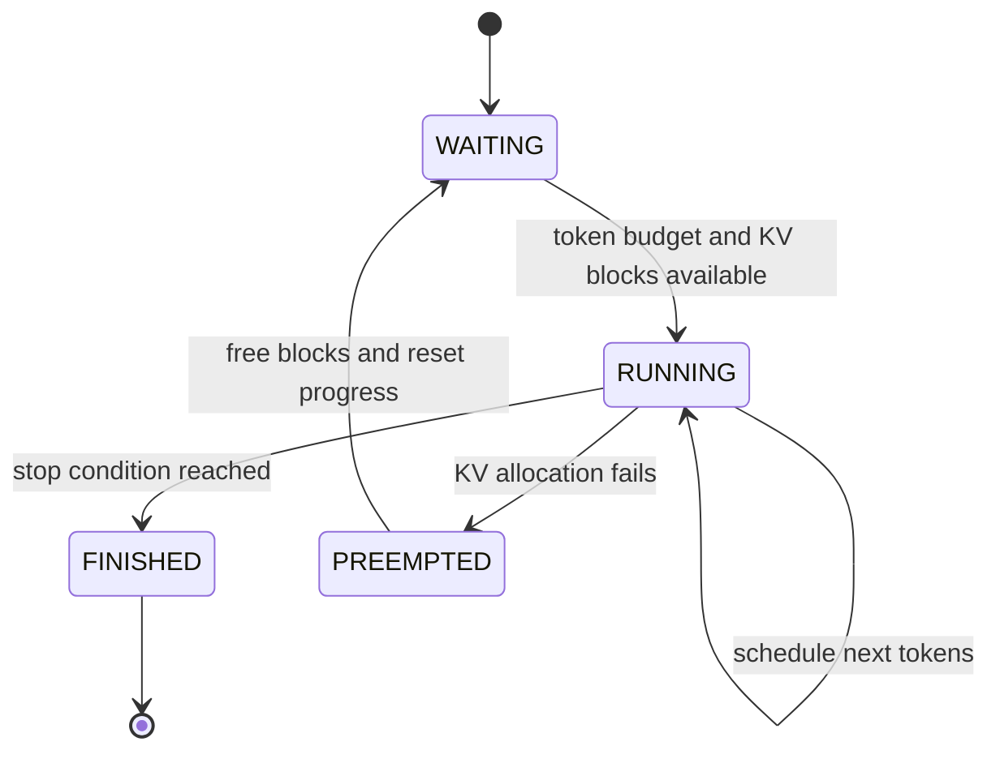

> [!note] 来源与适用范围
> 本页是对 KM 文章《[AI Infra入门：大模型是如何高效推理的](https://km.woa.com/articles/show/659449?kmref=profile_feeds)》（更新于 2026-05-12）的独立结构化笔记，不是原文转载。示例参数取自 Llama 3 8B；vLLM 行为按原文所分析的 v1 实现理解，版本升级后应以源码为准。公开版省略人员、组织、评论与内网运营信息。

## 一张图理解推理服务循环

高效推理不只是一次 Transformer 前向计算，而是一个持续运行的资源调度循环。系统每一轮选择一批**本轮需要计算的 token**，执行模型、采样出新 token，再把未结束的请求送回下一轮。

这里：

- $T$ 是本轮所有请求被调度 token 数之和；
- $R$ 是本轮需要采样的请求数；
- $H$ 是隐藏维度，$V$ 是词表大小；
- Transformer 主干按 token 展平计算，Attention 再借助序列边界恢复请求隔离。

## 连续批处理：调度计算，而不是调度完整请求

静态批处理要求一批请求同时开始、同时结束，而自回归生成的输出长度不可预测，短请求结束后会留下空槽。Continuous batching 把调度粒度下沉到 token：每个 step 都可以接纳新请求、推进运行中请求并移除已完成请求。

vLLM 调度器可以用两个计数理解：

$$
d_r
=
\texttt{num\_tokens}_r
-
\texttt{num\_computed\_tokens}_r ,
$$

其中 $d_r$ 是请求 $r$ 当前尚未计算的 token 数。每轮调度的目标是让 `num_computed_tokens` 追上 `num_tokens`，但必须同时满足：

| 约束                   | 控制对象                          |
| ---------------------- | --------------------------------- |
| `max_num_seqs`         | 最大并发运行请求数                |
| scheduled-token budget | 单步总计算量与 kernel shape       |
| `max_model_len`        | 单请求可接受的最大上下文          |
| free KV-cache blocks   | 本轮 token 是否有可写入的缓存空间 |

所有被选中的有效 token 会拼成 `[T]`，而不是补齐为 `[batch, max_seq_len]`。这消除了 padding，并让不同请求共同复用模型权重的读取成本。

## PagedAttention：让 KV 内存可以按块分配

若按请求一次性预留整段 KV Cache，未知输出长度会造成大量外部碎片。PagedAttention 把 KV Cache 划成固定大小的物理块，用 `block_table` 保存“请求的逻辑块 → GPU 物理块”映射：

$$
\text{KV cache shape}
=
[L,2,N_b,B,H_{kv},D_h].
$$

其中 $L$ 是层数，2 表示 K/V，$N_b$ 是物理块数，$B$ 是 block size，$H_{kv}$ 是 KV head 数，$D_h$ 是 head dimension。

`slot_mapping` 告诉 kernel 新 K/V 写到哪里，`block_table` 告诉 Attention kernel 去哪些物理块读取历史 K/V。它们不需要层维度：同一个 token 在每一层都使用相同的物理块号与块内偏移，只是访问不同层的缓存切片。

这种设计消除了外部碎片，也使 prefix caching、chunked prefill 与动态批处理更自然；代价是跨块读取会引入间接寻址并降低访存连续性。常见 `block_size = 16` 在两端取折中：块内仍可合并访存，同时分配粒度足够细。

## Llama 3 8B 的张量形状账本

令 $T=\texttt{num\_sched\_tokens}$。以下参数只用于建立量级直觉：

| 符号           | Llama 3 8B 示例 | 含义                          |
| -------------- | --------------: | ----------------------------- |
| $H$            |            4096 | hidden size                   |
| $H_q / H_{kv}$ |          32 / 8 | query heads / KV heads in GQA |
| $D_h$          |             128 | head dimension                |
| $I$            |           14336 | FFN intermediate size         |
| $V$            |          128256 | vocabulary size               |
| $L$            |              32 | Transformer layers            |

单个 Transformer block 的张量流如下：

| 阶段                       | 输入          | 输出                            | 系统层解释                                              |
| -------------------------- | ------------- | ------------------------------- | ------------------------------------------------------- |
| RMSNorm                    | `[T, 4096]`   | `[T, 4096]`                     | 逐通道缩放，可与 residual add 融合                      |
| Fused QKV                  | `[T, 4096]`   | `[T, 6144]`                     | 将 Q/K/V 三次投影合并成一次宽 GEMM                      |
| Split + RoPE               | `[T, 6144]`   | Q `[T,32,128]`; K/V `[T,8,128]` | Q/K 使用预计算 sin/cos 表；K/V 按 `slot_mapping` 写缓存 |
| Attention                  | Q + paged K/V | `[T,32,128]`                    | 通过 `cu_seqlens` 保持变长请求之间的隔离                |
| Concatenate + O projection | `[T,32,128]`  | `[T,4096]`                      | view 变换后执行输出投影                                 |
| Fused gate/up              | `[T,4096]`    | `[T,28672]`                     | 两个 FFN 投影合成一次 GEMM                              |
| SiLU-and-multiply          | `[T,28672]`   | `[T,14336]`                     | fused element-wise kernel                               |
| Down projection            | `[T,14336]`   | `[T,4096]`                      | 回到 residual stream                                    |

主干始终保持展平的 token 视角，但 Attention 不能让不同请求的 KV 相互混合。`cu_seqlens` 用累积序列长度给出请求边界，使 kernel 能处理变长序列，而不必真的构造带 padding 的三维 batch。

## 为什么 prefill 与 decode 的瓶颈不同

| 阶段    |    Query 长度 | 主要操作                                             | 典型瓶颈      |
| ------- | ------------: | ---------------------------------------------------- | ------------- |
| Prefill | prompt length | 大规模 GEMM；一次处理多个 token                      | compute-bound |
| Decode  |     usually 1 | GEMV-like projections；读取权重与持续增长的 KV Cache | memory-bound  |

Prefill 可以在请求内复用权重；continuous batching 又让多个请求在同一 step 复用权重。Decode 每个请求通常只新增一个 token，计算量小却仍要读取大量权重和历史 KV，因此显存带宽往往比 FLOPs 更先成为瓶颈。

FlashAttention 解决的是另一层 IO 问题：它通过 tiling、kernel fusion 与 online softmax，把 QK、softmax 和乘 V 的中间结果保留在片上存储，避免将完整注意力矩阵反复写回 HBM。

> [!important] 不要把两类优化混为一谈
> Continuous batching 主要摊薄模型权重读取并提高并发；PagedAttention 管理动态 KV 内存；FlashAttention 减少 Attention 中间张量的 HBM 流量。三者解决不同瓶颈，但共同决定端到端吞吐。

## LM head 与采样

在普通生成场景中，LM head 不需要为 prefill 的每个位置都产生词表 logits。系统先 gather 每个请求用于预测下一个 token 的隐藏状态：

$$
[T,H]\longrightarrow [R,H]\longrightarrow [R,V].
$$

随后进入采样链路：

理解参数时应关注它改变的是哪一层：

| 参数                | 作用                                     |
| ------------------- | ---------------------------------------- |
| `temperature`       | 调整分布尖锐程度；接近 0 时退化为 greedy |
| `top_k`             | 只保留分数最高的 $k$ 个候选              |
| `top_p`             | 保留累计概率达到阈值的最小候选集合       |
| `min_p`             | 按最高概率的相对比例自适应剪枝           |
| grammar / allowlist | 在每一步限制合法 token 集合              |
| repetition penalty  | 根据历史输出降低重复 token 的吸引力      |

按原文所述实现，若调用方请求原始 logprobs，应在 penalties、temperature 与截断前保存快照；否则返回值会混入采样策略的影响。

## KV 压力与抢占

当 RUNNING 请求无法再获得 KV block 时，vLLM v1 的思路是抢占低优先级运行请求：释放其 KV Cache，把 `num_computed_tokens` 归零并放回 WAITING，之后通过重新 prefill 恢复状态。

发生抢占说明缓存已经紧张，因此该 step 通常不再引入新的 WAITING 请求，以免触发连续抢占。v1 选择 recompute 而不是把 KV swap 到 host，体现了一个系统取舍：PCIe 往返、host 内存占用和额外状态机可能比重新 prefill 更昂贵。

## 一个紧凑的性能模型

可以用三类流量快速判断优化方向：

$$
\text{step time}
\approx
\max\left(
\frac{\text{FLOPs}}{\text{GPU compute}},
\frac{\text{model bytes}+\text{KV bytes}+\text{intermediate bytes}}{\text{HBM bandwidth}}
\right).
$$

- Prefill 慢：先检查 GEMM shape、Tensor Core 利用率、chunked prefill 和并行切分；
- Decode 慢：先检查 batch token 数、权重/KV 读取、上下文长度与 KV 布局；
- OOM 或 batch 上不去：检查 KV block 数、block size、最大上下文和调度预算；
- 吞吐高但单请求延迟差：检查 continuous batching 的 token budget 与公平性；
- 抢占频繁：说明 KV 容量、并发与上下文分布不匹配，不能只靠提高 batch 上限。

## 要点回顾

1. vLLM 的统一视角不是“先 prefill、再 decode”，而是让每个请求的 `num_computed_tokens` 追赶 `num_tokens`。
2. 展平 token 消除 padding；请求边界在 Attention kernel 内通过变长序列元数据恢复。
3. PagedAttention 用地址映射换取细粒度 KV 分配，核心收益是容量利用率而非单次访存速度。
4. Fused QKV、fused gate/up、fused residual-norm 和 FlashAttention 都在减少 kernel 启动或 HBM 往返。
5. Prefill 更偏计算受限，decode 更偏带宽受限；优化前必须先判断所处阶段与真正瓶颈。

## 主要参考资料

- [Efficient Memory Management for Large Language Model Serving with PagedAttention](https://arxiv.org/abs/2309.06180)
- [Orca: A Distributed Serving System for Transformer-Based Generative Models](https://www.usenix.org/conference/osdi22/presentation/yu)
- [FlashAttention: Fast and Memory-Efficient Exact Attention with IO-Awareness](https://arxiv.org/abs/2205.14135)
- [SARATHI: Efficient LLM Inference by Piggybacking Decodes with Chunked Prefills](https://arxiv.org/abs/2308.16369)
